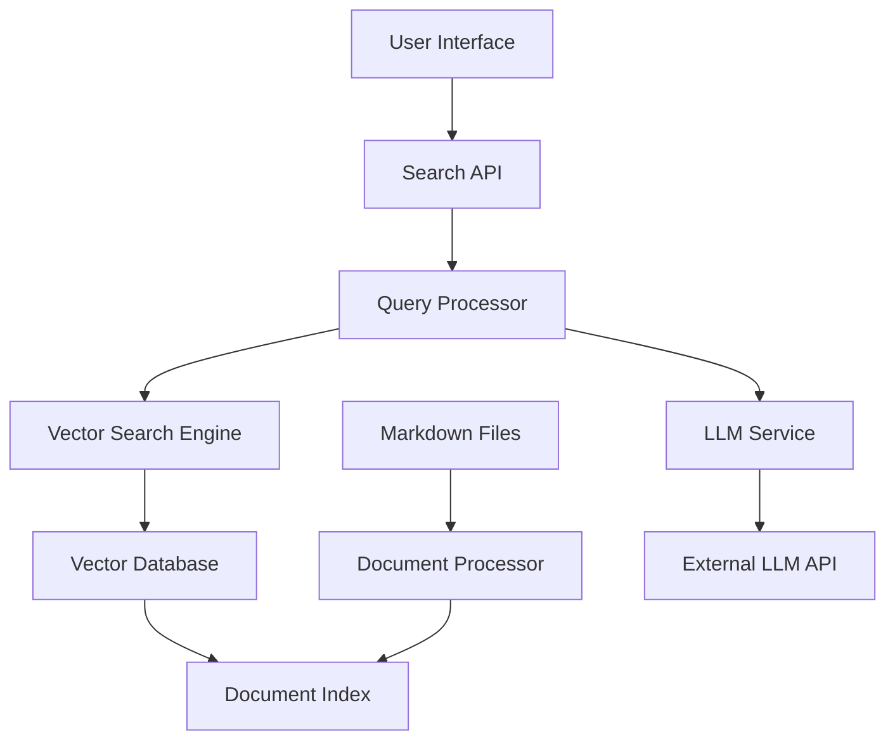

# Design Document

## Overview

The natural language search system will be implemented as a Node.js/TypeScript application that provides semantic search capabilities over a collection of Japanese legal documents. The system will use modern NLP techniques including embeddings and large language models to enable conversational search and question-answering.

## Architecture

### High-Level Architecture



### Core Components

1. **Document Processor**: Parses markdown files, extracts metadata, and creates searchable chunks
2. **Vector Search Engine**: Handles embedding generation and similarity search
3. **Query Processor**: Orchestrates search and response generation
4. **LLM Service**: Interfaces with language models for answer generation
5. **Search API**: RESTful API for frontend integration
6. **User Interface**: Web-based chat interface for natural language queries

## Components and Interfaces

### Document Processor

**Purpose**: Process markdown documents into searchable chunks with metadata extraction

**Key Functions**:
- Parse markdown files and extract structured content
- Extract metadata from filenames (law numbers, dates, categories)
- Split documents into semantic chunks for better search granularity
- Generate embeddings for each chunk

**Interfaces**:
```typescript
interface DocumentChunk {
  id: string;
  documentPath: string;
  title: string;
  content: string;
  metadata: DocumentMetadata;
  embedding?: number[];
}

interface DocumentMetadata {
  lawNumber?: string;
  date?: Date;
  category: string;
  era?: string;
}
```

### Vector Search Engine

**Purpose**: Provide semantic search capabilities using embeddings

**Key Functions**:
- Generate embeddings for queries and documents
- Perform similarity search across document chunks
- Rank results by relevance score
- Support filtering by metadata

**Interfaces**:
```typescript
interface SearchResult {
  chunk: DocumentChunk;
  score: number;
  highlights: string[];
}

interface SearchOptions {
  limit?: number;
  threshold?: number;
  filters?: MetadataFilter;
}
```

### Query Processor

**Purpose**: Orchestrate the search and response generation process

**Key Functions**:
- Process natural language queries
- Coordinate vector search and LLM response generation
- Maintain conversation context
- Generate citations and source references

**Interfaces**:
```typescript
interface QueryRequest {
  query: string;
  conversationId?: string;
  language?: 'ja' | 'en';
  filters?: SearchFilters;
}

interface QueryResponse {
  answer: string;
  sources: SourceCitation[];
  relatedQuestions: string[];
  conversationId: string;
}
```

### LLM Service

**Purpose**: Generate natural language responses using retrieved context

**Key Functions**:
- Format context from search results
- Generate conversational responses
- Maintain conversation history
- Handle both Japanese and English queries

**Configuration**:
- Support for multiple LLM providers (OpenAI, Anthropic, local models)
- Configurable prompts for different query types
- Context window management for long conversations

## Data Models

### Document Storage

Documents will be stored in their original markdown format with a separate index for search metadata:

```typescript
interface DocumentIndex {
  documents: Map<string, DocumentRecord>;
  chunks: Map<string, DocumentChunk>;
  embeddings: VectorStore;
}

interface DocumentRecord {
  path: string;
  title: string;
  lastModified: Date;
  metadata: DocumentMetadata;
  chunkIds: string[];
}
```

### Vector Storage

Using a vector database (e.g., Chroma, Pinecone, or local FAISS) to store embeddings:

```typescript
interface VectorStore {
  addEmbeddings(chunks: DocumentChunk[]): Promise<void>;
  search(query: string, options: SearchOptions): Promise<SearchResult[]>;
  updateEmbedding(chunkId: string, embedding: number[]): Promise<void>;
  deleteEmbeddings(chunkIds: string[]): Promise<void>;
}
```

### Conversation Management

```typescript
interface Conversation {
  id: string;
  messages: ConversationMessage[];
  createdAt: Date;
  lastActivity: Date;
}

interface ConversationMessage {
  role: 'user' | 'assistant';
  content: string;
  sources?: SourceCitation[];
  timestamp: Date;
}
```

## Error Handling

### Search Errors
- Handle embedding generation failures with fallback to keyword search
- Graceful degradation when LLM service is unavailable
- Timeout handling for long-running queries

### Data Processing Errors
- Skip malformed documents with logging
- Handle encoding issues in Japanese text
- Retry mechanisms for transient failures

### User Experience Errors
- Clear error messages for unsupported queries
- Suggestions for query refinement
- Fallback responses when no relevant results found

## Testing Strategy

### Unit Testing
- Document parsing and metadata extraction
- Embedding generation and similarity calculations
- Query processing logic
- LLM response formatting

### Integration Testing
- End-to-end search workflows
- Conversation context maintenance
- Multi-language query handling
- Performance testing with large document sets

### User Acceptance Testing
- Natural language query accuracy
- Response relevance and quality
- Citation accuracy and completeness
- User interface usability

## Performance Considerations

### Indexing Performance
- Batch processing for initial document indexing
- Incremental updates for new/modified documents
- Parallel processing for embedding generation
- Efficient storage of high-dimensional vectors

### Query Performance
- Vector search optimization with approximate nearest neighbor algorithms
- Caching of frequently accessed embeddings
- Query result caching for common questions
- Streaming responses for long answers

### Scalability
- Horizontal scaling of vector search components
- Load balancing for LLM API calls
- Database sharding for large document collections
- CDN integration for static assets

## Security and Privacy

### Data Protection
- No external transmission of document content without user consent
- Local processing options for sensitive documents
- Secure storage of conversation history
- Data retention policies for user interactions

### API Security
- Rate limiting for search endpoints
- Input validation and sanitization
- Authentication for administrative functions
- Audit logging for system access